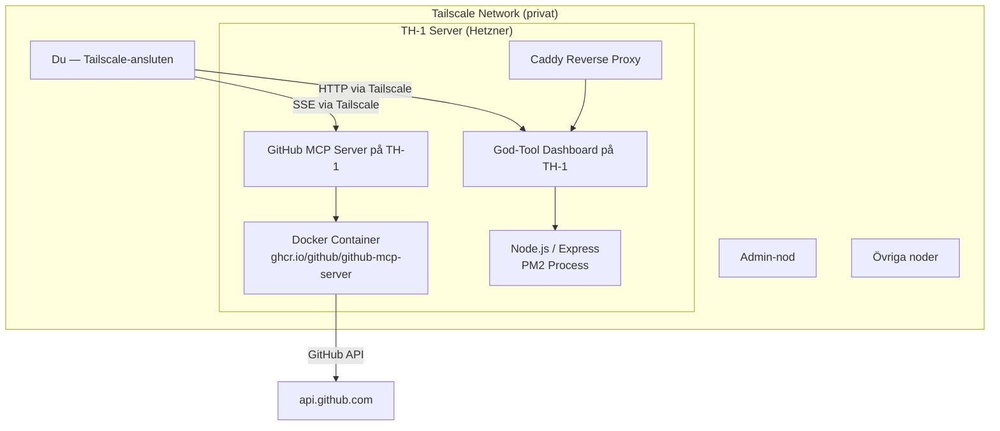

# Track-N-Show: TH-1 Infrastructure & AI Toolkit Map

> **Syfte:** Dokumentera TH-1-servern och ett kurerat AI-verktygsbibliotek.
> Känsliga detaljer (IPs, portar, tokens) förvaras **aldrig** i detta repo — se intern wiki.

---

## 🗺️ Innehållsförteckning

| Dokument | Beskrivning |
|----------|-------------|
| [SERVER_MAP_TH1.md](./SERVER_MAP_TH1.md) | Serverkartering för TH-1 (desensitiserad) |
| [docs/MCP_SERVER_SETUP.md](./docs/MCP_SERVER_SETUP.md) | GitHub MCP Server setup via Tailscale |
| [docs/AZURE_DEVOPS_TOP20.md](./docs/AZURE_DEVOPS_TOP20.md) | Top 20: Azure DevOps resurser |
| [docs/AWESOME_AGENTS_TOP20.md](./docs/AWESOME_AGENTS_TOP20.md) | Top 20: AI Agent frameworks |
| [docs/MCP_SERVERS_TOP20.md](./docs/MCP_SERVERS_TOP20.md) | Top 20: MCP Servers |
| [docs/COPILOT_HOOKS.md](./docs/COPILOT_HOOKS.md) | Alla 6 Copilot Hooks |
| [docs/COPILOT_PLUGINS_TOP20.md](./docs/COPILOT_PLUGINS_TOP20.md) | Top 20: Copilot Plugins |
| [docs/COPILOT_SKILLS_TOP20.md](./docs/COPILOT_SKILLS_TOP20.md) | Top 20: Copilot Skills |
| [docs/COPILOT_INSTRUCTIONS_TOP20.md](./docs/COPILOT_INSTRUCTIONS_TOP20.md) | Top 20: Copilot Instructions |
| [docs/COPILOT_AGENTS_TOP20.md](./docs/COPILOT_AGENTS_TOP20.md) | Top 20: Copilot Agents |

---

## 🖥️ Serveröversikt (TH-1)

```
┌────────────────────────────────────────────────────────────┐
│                    TH-1 (townhouse-8gb-one)                 │
│                   Hetzner vServer — Ubuntu 24.04            │
│                                                             │
│  ┌──────────────┐  ┌──────────────┐  ┌─────────────────┐  │
│  │   Caddy      │  │  god-tool    │  │ github-mcp-     │  │
│  │  HTTP proxy  │  │  Dashboard   │  │ server (SSE)    │  │
│  │  (port fwd)  │  │  Node.js/PM2 │  │ Docker/PM2      │  │
│  └──────────────┘  └──────────────┘  └─────────────────┘  │
│                                                             │
│  Tailscale-nätverket: 4 aktiva noder                        │
│  (se intern wiki för IP-detaljer)                           │
└────────────────────────────────────────────────────────────┘
```

---

## 🤖 AI Toolkit Stack (Kurerat)

### Aktiva tjänster på TH-1

| Service | Åtkomst | Status |
|---------|---------|--------|
| GitHub MCP Server (SSE) | Via Tailscale — se intern wiki | ✅ Online |
| God-Tool Dashboard | Via Tailscale — se intern wiki | ✅ Online |

### Resources per kategori

```
Azure DevOps ──────► 20 resurser  [docs/AZURE_DEVOPS_TOP20.md]
AI Agents    ──────► 20 agenter   [docs/AWESOME_AGENTS_TOP20.md]
MCP Servers  ──────► 20 servrar   [docs/MCP_SERVERS_TOP20.md]
Copilot Hooks ─────►  6 hooks     [docs/COPILOT_HOOKS.md]
Copilot Plugins ───► 20 plugins   [docs/COPILOT_PLUGINS_TOP20.md]
Copilot Skills ────► 20 skills    [docs/COPILOT_SKILLS_TOP20.md]
Copilot Instructions► 20 instr.   [docs/COPILOT_INSTRUCTIONS_TOP20.md]
Copilot Agents ────► 20 agenter   [docs/COPILOT_AGENTS_TOP20.md]
```

---

## 🔌 MCP Server Snabbstart

```json
// Lägg till i din MCP-klientkonfig (kräver Tailscale-anslutning)
{
  "mcpServers": {
    "github": {
      "type": "sse",
      "url": "http://<TH1_TAILSCALE_IP>:<MCP_PORT>/sse"
    }
  }
}
```

> Hämta `<TH1_TAILSCALE_IP>` och `<MCP_PORT>` från intern wiki eller fråga repo-ägaren.

Se [docs/MCP_SERVER_SETUP.md](./docs/MCP_SERVER_SETUP.md) för fullständig setup-guide.

---

## 📊 Grafisk Översikt (Mermaid)



---

## 🔒 Säkerhetspolicy för detta repo

- **Inga IPs** — varken publika eller privata/Tailscale
- **Inga portar** — använd tjänstnamn istället
- **Inga tokens/credentials** — inte ens i kommentarer
- **Inga sökvägar** — inga absoluta filsystemssökvägar
- **Inga nodnamn** — Tailscale-nodnamn är interna

Brott mot ovanstående fångas automatiskt av [`.github/workflows/secret-scan.yml`](./.github/workflows/secret-scan.yml).

---

*Genererat av Claude Code — 2026-04-16*
