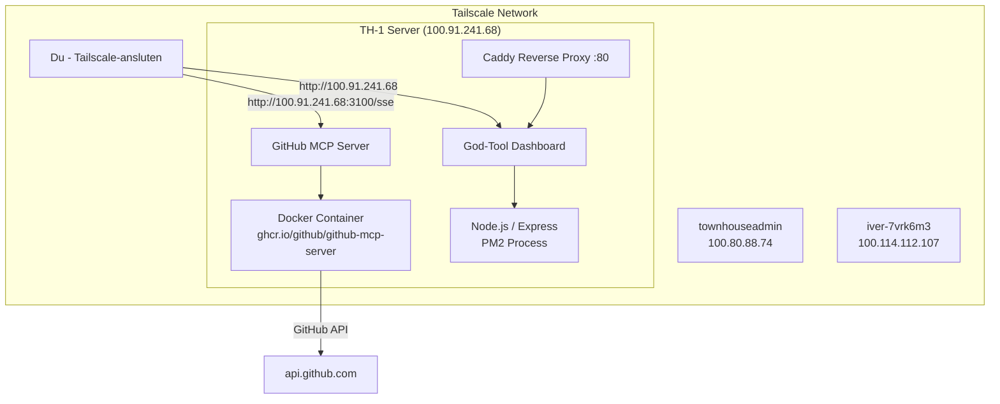

# Track-N-Show: TH-1 Infrastructure & AI Toolkit Map

> **Syfte:** Dokumentera TH-1-servern, dess konfiguration och ett kurerat AI-verktygsbibliotek
> **Server:** townhouse-8gb-one | **Tailscale IP:** 100.91.241.68 | **Senast uppdaterad:** 2026-04-16

---

## 🗺️ Innehållsförteckning

| Dokument | Beskrivning |
|----------|-------------|
| [SERVER_MAP_TH1.md](./SERVER_MAP_TH1.md) | Komplett serverkartering för TH-1 |
| [docs/MCP_SERVER_SETUP.md](./docs/MCP_SERVER_SETUP.md) | GitHub MCP Server setup via Tailscale |
| [docs/AZURE_DEVOPS_TOP20.md](./docs/AZURE_DEVOPS_TOP20.md) | Top 20: Azure DevOps resurser |
| [docs/AWESOME_AGENTS_TOP20.md](./docs/AWESOME_AGENTS_TOP20.md) | Top 20: AI Agent frameworks |
| [docs/MCP_SERVERS_TOP20.md](./docs/MCP_SERVERS_TOP20.md) | Top 20: MCP Servers |
| [docs/COPILOT_HOOKS.md](./docs/COPILOT_HOOKS.md) | Alla 6 Copilot Hooks |
| [docs/COPILOT_PLUGINS_TOP20.md](./docs/COPILOT_PLUGINS_TOP20.md) | Top 20: Copilot Plugins |
| [docs/COPILOT_SKILLS_TOP20.md](./docs/COPILOT_SKILLS_TOP20.md) | Top 20: Copilot Skills |
| [docs/COPILOT_INSTRUCTIONS_TOP20.md](./docs/COPILOT_INSTRUCTIONS_TOP20.md) | Top 20: Copilot Instructions |
| [docs/COPILOT_AGENTS_TOP20.md](./docs/COPILOT_AGENTS_TOP20.md) | Top 20: Copilot Agents |

---

## 🖥️ Serveröversikt (TH-1)

```
┌────────────────────────────────────────────────────────────┐
│                    TH-1 (townhouse-8gb-one)                 │
│                   Hetzner vServer — Ubuntu 24.04            │
│                                                             │
│  Tailscale IP: 100.91.241.68                                │
│  Public IP:    204.168.246.143                              │
│                                                             │
│  ┌──────────────┐  ┌──────────────┐  ┌─────────────────┐  │
│  │   Caddy      │  │  god-tool    │  │ github-mcp-     │  │
│  │  Port 80     │  │  Port 3000   │  │ server Port 3100│  │
│  │  (Reverse    │  │  (Dashboard) │  │ (MCP via SSE)   │  │
│  │   Proxy)     │  │  Node.js/PM2 │  │ Docker/PM2      │  │
│  └──────────────┘  └──────────────┘  └─────────────────┘  │
│                                                             │
│  Tailscale Network Members:                                 │
│  • townhouse-8gb-one (100.91.241.68) ◄── DEN HÄR           │
│  • townhouseadmin    (100.80.88.74)                         │
│  • iver-7vrk6m3      (100.114.112.107)                      │
│  • demo              (100.119.175.112)                      │
└────────────────────────────────────────────────────────────┘
```

---

## 🤖 AI Toolkit Stack (Kurerat)

### Aktiva på TH-1
| Service | URL | Status |
|---------|-----|--------|
| GitHub MCP Server (SSE) | `http://100.91.241.68:3100/sse` | ✅ Online |
| God-Tool Dashboard | `http://100.91.241.68:3000` / `http://100.91.241.68` | ✅ Online |

### Top Resources per Kategori

```
Azure DevOps ──────► 20 resurser  [docs/AZURE_DEVOPS_TOP20.md]
AI Agents    ──────► 20 agenter   [docs/AWESOME_AGENTS_TOP20.md]
MCP Servers  ──────► 20 servrar   [docs/MCP_SERVERS_TOP20.md]
Copilot Hooks ─────►  6 hooks     [docs/COPILOT_HOOKS.md]
Copilot Plugins ───► 20 plugins   [docs/COPILOT_PLUGINS_TOP20.md]
Copilot Skills ────► 20 skills    [docs/COPILOT_SKILLS_TOP20.md]
Copilot Instructions► 20 instr.   [docs/COPILOT_INSTRUCTIONS_TOP20.md]
Copilot Agents ────► 20 agenter   [docs/COPILOT_AGENTS_TOP20.md]
```

---

## 🔌 MCP Server Snabbstart

```bash
# Anslut via Claude Code (kräver Tailscale)
# Lägg till i ~/.claude.json:
{
  "mcpServers": {
    "github": {
      "type": "sse",
      "url": "http://100.91.241.68:3100/sse"
    }
  }
}
```

Se [docs/MCP_SERVER_SETUP.md](./docs/MCP_SERVER_SETUP.md) för fullständig setup-guide.

---

## 📊 Grafisk Översikt (Mermaid)



---

*Genererat av Claude Code (Sonnet 4.6) — 2026-04-16*
